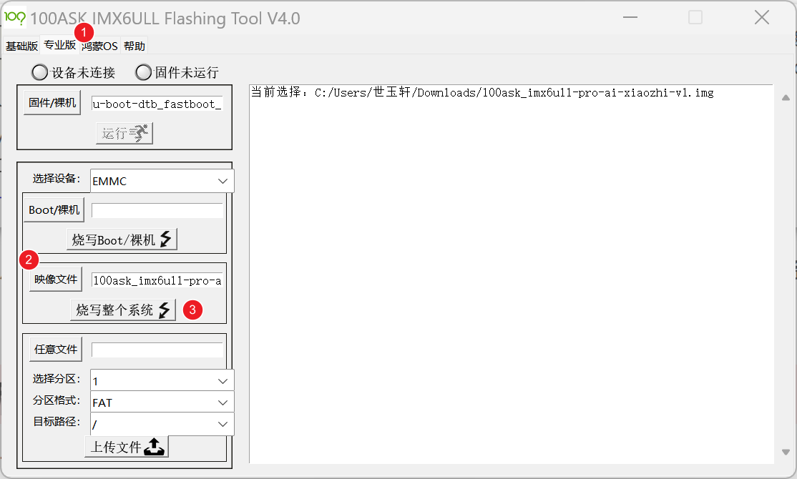

# IMX6ULL-PRO 运行AI小智

## 环境配置

开发环境建议 ubuntu18 版本下

获取源码：

```bash
git clone https://e.coding.net/weidongshan/buildroot/buildroot.git Buildoot20-imx6ull
git clone -b imx6ull https://e.coding.net/weidongshan/ST-Buildoot-dl/ST-Buildoot-dl.git dl
cd  Buildoot20-imx6ull 
cp ../dl -rfvd .
make 100ask_imx6ull-pro-aixiaozhi_defconfig
make -j32
```

编译完成后，会在 output/images/ 生成一个 100ask_imx6ull-pro-ai-xiaozhi-v1.img 系统镜像文件。将其拷贝到Windows 系统中。

## 烧写启动

烧写工具下载：

https://dl.100ask.net/Hardware/MPU/IMX6ULL-PRO/100ask_imx6ull_flashing_tool_v4.0.zip

下载完成后解压打开，双击运行 100ask_imx6ull_flashing_tool_v4.0.exe 之后按照如下图所示 切换到 专业版 界面，之后点击映像文件，选择我们编译生成的100ask_imx6ull-pro-ai-xiaozhi-v1.img 镜像，然后将开发板设置为USB 烧录模式 （不懂可以看 http://wiki.100ask.org/100ask_imx6ull_tool）  烧录完成后，设置emmc启动，即可正常进入 AI小智系统。

注意： 启动需要先将 可以联网的 网线 连接至 开发板 ETH1 /ETH0 接口。



